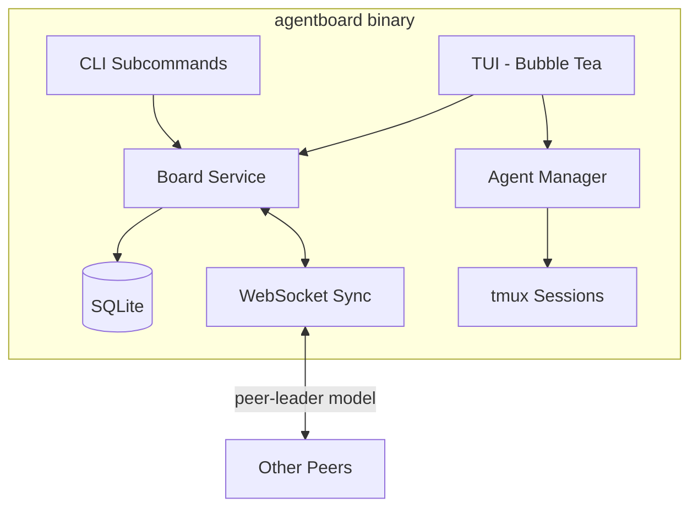

```
 ┌─────────────────────────────┐
 │        agentboard           │
 │  collaborative kanban tui   │
 └─────────────────────────────┘
```

Real-time collaborative Kanban board for AI coding agents. Terminal-native. Agent-agnostic.

<!-- TODO: Add terminal screenshot/GIF -->

## Prerequisites

| Prerequisite | Version | Purpose |
|---|---|---|
| [tmux](https://github.com/tmux/tmux) | 3.0+ | Agent session management |
| [gh CLI](https://cli.github.com/) | 2.0+ | GitHub authentication |
| AI CLI tool | any | Claude Code, Cursor, Antigravity, etc. |

**Platform:** macOS and Linux are fully supported. Windows requires WSL.

## Installation

### Quick install (recommended)

```bash
curl -fsSL https://raw.githubusercontent.com/markx3/agentboard/main/install.sh | bash
```

Or if you prefer to inspect the script first:

```bash
curl -fsSL https://raw.githubusercontent.com/markx3/agentboard/main/install.sh -o install.sh
less install.sh
bash install.sh
```

### Other methods

```bash
# Via go install (requires Go 1.25+)
go install github.com/marcosfelipeeipper/agentboard/cmd/agentboard@latest

# Or build from source
git clone https://github.com/markx3/agentboard.git
cd agentboard
go build -o agentboard ./cmd/agentboard
```

## Quick Start

### Starting a new project

```bash
agentboard init    # creates .agentboard/ directory
agentboard         # launch TUI (becomes peer-leader)
```

### Joining an existing board

```bash
agentboard                         # auto-discovers via .agentboard/server.json
agentboard --connect host:port     # manual connection
```

## Features

- **Collaborative Kanban board** in the terminal
- **Real-time sync** via WebSocket (peer-leader model)
- **Agent-agnostic** — works with any AI CLI tool
- **Agent lifecycle management** — spawn, monitor, and kill agents via tmux
- **CLI-first design** — TUI for interactive use, subcommands for scripting
- **SQLite-backed** local persistence
- **Git worktree isolation** per task

## Key Bindings

| Key | Action |
|---|---|
| `h` / `l` (or arrows) | Previous / next column |
| `j` / `k` (or arrows) | Next / previous task |
| `o` | New task |
| `enter` | Open task detail |
| `m` | Move task right |
| `M` | Move task left |
| `x` | Delete task |
| `a` | Spawn agent |
| `A` | Kill agent |
| `v` | View agent session |
| `?` | Help |
| `q` | Quit |
| `esc` | Close overlay / cancel |

## Supported Agents

| Agent | Command | Status |
|---|---|---|
| Claude Code | `claude` | Supported |
| Cursor CLI | `cursor` | Supported |
| Antigravity | `antigravity` | Supported |
| Custom | Detected via PATH | Configurable |

## CLI Reference

### Root command

```
agentboard [--connect <host:port>]
```

Launches the TUI. Use `--connect` to connect to a specific server instead of auto-discovering.

### Subcommands

| Command | Description | Key Flags |
|---|---|---|
| `init` | Initialize project config | -- |
| `serve` | Start dedicated server (no TUI) | `--port`, `-p` (default: random), `--bind` (default: 127.0.0.1) |
| `status` | Show board summary | `--json` |
| `task list` | List tasks | `--status`, `--assignee`, `--json` |
| `task create` | Create a new task | `--title` (required), `--description` |
| `task move <id> <column>` | Move task to column | -- |
| `task get <id>` | Get task details | `--json` |
| `task delete <id>` | Delete a task | -- |
| `task claim <id>` | Claim a task | `--user` |
| `task unclaim <id>` | Unclaim a task | -- |

**Valid columns for `task move`:** `backlog`, `planning`, `in_progress`, `review`, `done`

**Task IDs** accept short prefixes (first 8 chars shown in `task list`).

## Configuration

Running `agentboard init` creates:

```
.agentboard/
  config.toml    # project config (commit this)
  .gitignore     # auto-generated (ignores server.json, worktrees/)
  board.db       # SQLite database (auto-created on first run)
  server.json    # ephemeral peer discovery (gitignored)
```

**Default `config.toml`:**

```toml
[project]
name = ""

[agent]
preferred = "claude"

[worktree]
copy_files = [".env", ".env.local"]
init_script = ""
```

## Architecture



## How It Works

Agentboard uses a **peer-leader model** for collaboration. The first instance to start becomes the leader and runs a WebSocket server. Other instances connect as peers and sync in real time.

When you close the TUI, your agents keep running in their tmux sessions. Relaunch `agentboard` to reconnect and resume where you left off.

The TUI and CLI subcommands share the same binary and the same SQLite database. You can use `agentboard task list` in scripts while the TUI is running — they operate on the same data.

## Dependencies

| Library | Purpose |
|---|---|
| [Bubble Tea](https://github.com/charmbracelet/bubbletea) | Terminal UI framework |
| [Bubbles](https://github.com/charmbracelet/bubbles) | TUI components |
| [Lip Gloss](https://github.com/charmbracelet/lipgloss) | Terminal styling |
| [Cobra](https://github.com/spf13/cobra) | CLI framework |
| [gorilla/websocket](https://github.com/gorilla/websocket) | WebSocket communication |
| [modernc.org/sqlite](https://pkg.go.dev/modernc.org/sqlite) | Pure-Go SQLite driver |
| [google/uuid](https://github.com/google/uuid) | UUID generation |

## Roadmap

Current status: **MVP complete** (Phases 1-5).

Planned:
- Homebrew distribution
- Enhanced agent detection
- TLS/WSS for remote connections

## Contributing

```bash
# Build from source
git clone https://github.com/markx3/agentboard.git
cd agentboard
go build -o agentboard ./cmd/agentboard

# Run tests
go test ./...
```

The project follows standard Go conventions with an `internal/` package layout. See the [Architecture](#architecture) section for an overview.

## License

<!-- TODO: Choose a license -->
