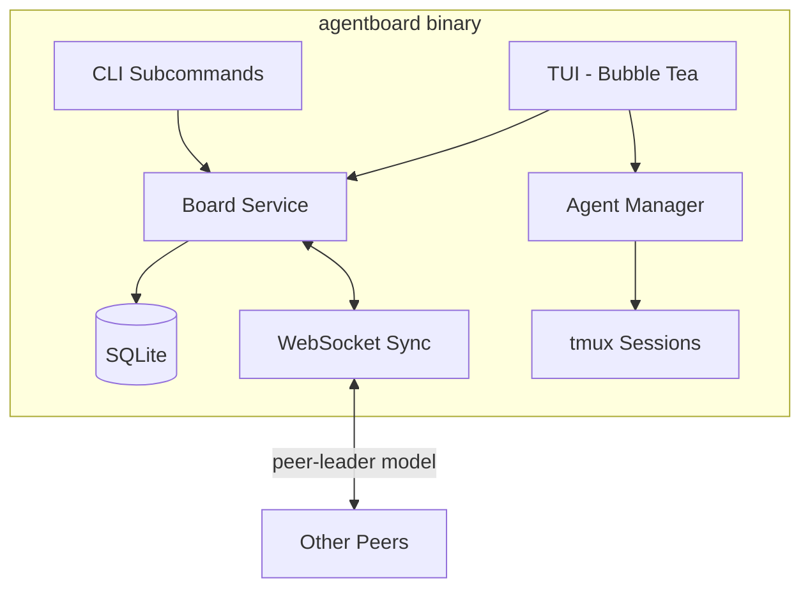

# docs: Add README.md

## Overview

Create a comprehensive, standalone README.md for agentboard — a terminal-based collaborative Kanban board for managing agentic coding tasks. The README serves both end users (teams adopting agentboard) and contributors (developers building on it).

Follows the **Getting-Started-First** structure decided in the brainstorm: overview -> install -> quick start -> features -> reference. Target length: 300-500 lines.

## Acceptance Criteria

- [x] README.md exists at the repository root
- [x] Contains all sections from the accepted brainstorm
- [x] All CLI commands and flags are accurate (verified against source code)
- [x] Key bindings match actual implementation in `internal/tui/keys.go`
- [x] Task statuses match `internal/db/models.go` (backlog, planning, in_progress, review, done)
- [x] Architecture mermaid diagram renders correctly on GitHub
- [x] Prerequisites are accurate (Go 1.25.0+, tmux 3.0+, gh CLI 2.0+)
- [x] Quick start covers both "new project" and "joining a team" paths

## Section-by-Section Plan

### 1. Header Block

**ASCII banner** — compact 3-5 line box-drawing style logo with the name "agentboard".

**One-liner:** "Real-time collaborative Kanban board for AI coding agents. Terminal-native. Agent-agnostic."

**Screenshot placeholder** — `<!-- TODO: Add terminal screenshot/GIF -->` until we have one.

### 2. Prerequisites

From verified source code and `go.mod`:

| Prerequisite | Version | Purpose |
|---|---|---|
| Go | 1.25.0+ | Build and install |
| tmux | 3.0+ | Agent session management |
| gh CLI | 2.0+ | GitHub authentication |
| AI CLI tool | any | Claude Code, Cursor, Antigravity, etc. |

**Platform note:** macOS and Linux are fully supported. Windows requires WSL.

### 3. Installation

Two methods, verified from source:

```bash
# Primary: go install
go install github.com/markx3/agentboard/cmd/agentboard@latest

# Secondary: build from source
git clone https://github.com/markx3/agentboard.git
cd agentboard
go build -o agentboard ./cmd/agentboard
```

### 4. Quick Start

Two paths (addresses SpecFlow Gap 1):

**Starting a new project:**
```
agentboard init    # creates .agentboard/
agentboard         # launch TUI (becomes peer-leader)
```

**Joining an existing board:**
```
agentboard                         # auto-discovers via .agentboard/server.json
agentboard --connect host:port     # manual connection
```

### 5. Features List

Concise bullet list covering:
- Collaborative Kanban board in the terminal
- Real-time sync via WebSocket (peer-leader model)
- Agent-agnostic (any AI CLI tool)
- Agent lifecycle management (spawn, monitor, kill via tmux)
- CLI-first design (TUI + programmatic subcommands)
- SQLite-backed local persistence
- Git worktree isolation per task

### 6. Key Bindings

From verified `internal/tui/keys.go`:

| Key | Action |
|---|---|
| `h` / `l` | Previous / next column |
| `j` / `k` | Previous / next task |
| `o` | New task |
| `enter` | Open task detail |
| `m` / `M` | Move task right / left |
| `x` | Delete task |
| `a` | Spawn agent |
| `A` | Kill agent |
| `v` | View agent session |
| `?` | Help |
| `q` | Quit |
| `esc` | Close overlay / cancel |

### 7. Supported Agents Table

| Agent | Command | Status |
|---|---|---|
| Claude Code | `claude` | Supported |
| Cursor CLI | `cursor` | Supported |
| Antigravity | `antigravity` | Supported |
| Custom | Detected via PATH | Configurable |

### 8. CLI Reference

All commands verified from source (`internal/cli/`):

**Root command:**
```
agentboard [--connect <host:port>]
```

**Subcommands:**

| Command | Description | Key Flags |
|---|---|---|
| `init` | Initialize project config | — |
| `serve` | Start dedicated server (no TUI) | `--port`, `-p` (default: random) `--bind` (default: 127.0.0.1) |
| `status` | Show board summary | `--json` |
| `task list` | List tasks | `--status`, `--assignee`, `--json` |
| `task create` | Create a new task | `--title` (required), `--description` |
| `task move <id> <column>` | Move task to column | — |
| `task get <id>` | Get task details | `--json` |
| `task delete <id>` | Delete a task | — |
| `task claim <id>` | Claim a task | `--user` |
| `task unclaim <id>` | Unclaim a task | — |
| `peers` | Show connected peers | — |

**Valid columns for `task move`:** `backlog`, `planning`, `in_progress`, `review`, `done`

**Task IDs** accept short prefixes (first 8 chars shown in `task list`).

### 9. Configuration

Document what `agentboard init` creates (from `internal/cli/init_cmd.go`):

```
.agentboard/
  config.toml    # project config (commit this)
  .gitignore     # auto-generated (ignores server.json, worktrees/)
  board.db       # SQLite database (auto-created on first run)
  server.json    # ephemeral peer discovery (gitignored)
```

**Default config.toml:**
```toml
[project]
name = ""

[agent]
preferred = "claude"

[worktree]
copy_files = [".env", ".env.local"]
init_script = ""
```

### 10. Architecture

Mermaid component diagram showing:
- TUI (Bubble Tea) -> Board Service interface
- Board Service -> SQLite (local persistence)
- CLI subcommands -> Board Service (same interface)
- WebSocket Server/Client (peer sync layer)
- Agent Orchestration (tmux sessions + git worktrees)



### 11. How It Works (brief)

Short prose section (addresses SpecFlow Gap 21):
- Explain peer-leader model in plain language
- What happens when you close the TUI
- Relationship between TUI and CLI subcommands (same binary, same database)

### 12. Roadmap

Current status: MVP complete (Phases 1-5). Highlight future items:
- Homebrew distribution
- Optional Review column workflow
- Enhanced agent detection
- TLS/WSS for remote connections

### 13. Contributing

Brief section:
- Build from source instructions
- `go test ./...` for running tests
- Project structure overview (link to Architecture section)
- Standard Go `internal/` layout

### 14. License

Placeholder — no LICENSE file exists yet. Add `<!-- TODO: Choose a license -->` or ask user.

## Implementation Notes

### What to verify against source code during implementation

These source files are the ground truth:

| Section | Source of Truth |
|---|---|
| Key bindings | `internal/tui/keys.go` |
| Task statuses | `internal/db/models.go` |
| CLI commands & flags | `internal/cli/*.go` |
| Config format | `internal/cli/init_cmd.go` |
| DB path | `internal/cli/root.go:34` (`.agentboard/board.db`) |
| Serve flags | `internal/cli/serve.go:30-31` |
| Go version | `go.mod:3` (Go 1.25.0) |

### SpecFlow gaps addressed in this plan

| Gap | Resolution |
|---|---|
| No "Team Joiner" quick start | Added dual-path quick start (Section 4) |
| Missing CLI flags | Full flag reference from source (Section 8) |
| Missing `serve` flags | Documented `--port` and `--bind` (Section 8) |
| `init` behavior unclear | Documented what it creates (Section 9) |
| Platform notes absent | Added WSL note (Section 2) |
| Key bindings incomplete | Full list from source (Section 6) |
| No "How It Works" section | Added brief prose section (Section 11) |
| `.agentboard/` structure undocumented | Documented with gitignore guidance (Section 9) |

### SpecFlow gaps deferred (not in scope for README MVP)

| Gap | Reason |
|---|---|
| Troubleshooting / FAQ | Can be added after user feedback reveals common issues |
| Security model section | Document after TLS support lands |
| Uninstall / cleanup section | Low priority for MVP |
| Example JSON output | Nice-to-have, can add later |
| Full config reference | Config is minimal now; document as it grows |

## References

- Brainstorm: `docs/brainstorms/2026-02-23-readme-brainstorm.md`
- Implementation plan: `docs/plans/2026-02-23-feat-agentboard-collaborative-kanban-tui-plan.md`
- Feature brainstorm: `docs/brainstorms/2026-02-23-agentboard-brainstorm.md`
