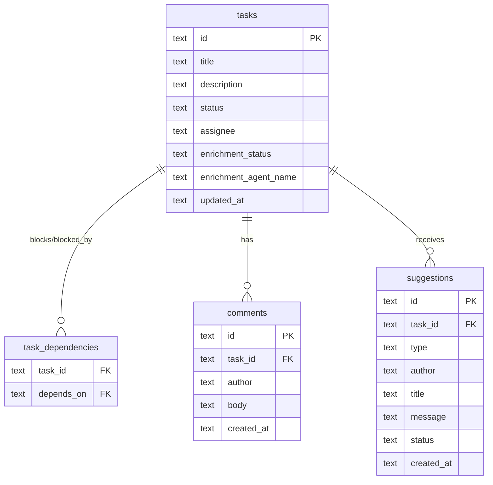

# Agent-Driven Development Powerhouse

## Enhancement Summary

**Deepened on:** 2026-02-23
**Research agents used:** architecture-strategist, performance-oracle, security-sentinel, data-migration-expert, data-integrity-guardian, pattern-recognition-specialist, code-simplicity-reviewer, agent-native-reviewer, best-practices-researcher, framework-docs-researcher

### Key Improvements

1. **CRITICAL migration safety**: `PRAGMA foreign_keys=OFF` required during table rebuild or `DROP TABLE tasks` cascades to delete ALL comments. Explicit INSERT column listing mandatory.
2. **CRITICAL SQLite DSN fix**: Add `_txlock=immediate` to connection string -- without it `busy_timeout` doesn't work for lock escalation under multi-process writes (enrichment agents + TUI + CLI all write concurrently).
3. **Type safety overhaul**: Replace `map[string]interface{}` in `UpdateTaskFields` with typed `TaskFieldUpdate` struct using pointer fields -- the map approach violates every codebase pattern.
4. **Concurrent enrichment cap**: Limit to 2-3 concurrent enrichment agents to prevent SQLite saturation.
5. **Agent-native CLI**: Every CLI command must support `--json` (persistent flag on root). Add `agent start`/`agent kill` commands. Add suggestion accept/dismiss/list. Include deps/comments in `task get --json`.
6. **Shell-level timeout**: Use `timeout 90 claude ...` instead of application-level timeout tracking for enrichment -- simpler, more reliable. Defer `enrichment_started_at` column to post-v1.
7. **Simplify interfaces**: Add `BuildEnrichmentCommand` directly to `AgentRunner` (both runners implement it). Skip Service interface decomposition. Skip `Enricher` composition -- premature for 2 runners.
8. **Transaction boundaries**: `AcceptSuggestion` (create task + update suggestion) needs explicit transaction.
9. **SpawnEnrichment race**: Must use partial `UpdateTaskFields` (not full `UpdateTask`) to avoid overwriting concurrent edits. Same for enrichment reconciliation.
10. **Verify `_txlock=immediate` with modernc.org/sqlite**: This DSN parameter is a `mattn/go-sqlite3` convention. Must verify or implement `BEGIN IMMEDIATE` helper as fallback.
11. **Migration PRAGMA ordering**: `PRAGMA foreign_keys=OFF` is silently ignored inside transactions. Must execute outside `BeginTx`.

### New Considerations Discovered

- `_txlock=immediate` may not be supported by modernc.org/sqlite -- verify or implement `BeginImmediate` helper
- `PRAGMA foreign_keys=OFF` silently ignored inside transactions -- must execute outside `BeginTx`
- 5 critical agent-native gaps: no `agent start`/`agent kill`, no suggestion accept/dismiss/list CLI
- `--json` flag not registered on most existing mutation commands (silently ignored)
- `tmux.ListWindows()` must be cached once per tick (shared across agent + enrichment reconciliation)
- Simplicity: ~300-335 LOC savings (20-25%) by cutting deferred features, inlining enrichment tracker, using notifications instead of suggestion bar

### Technical Review Todos

11 findings created in `todos/` directory (011-021). See `todos/011-pending-p1-*.md` through `todos/021-pending-p3-*.md`.

## Overview

Transform agentboard from a task tracker into an intelligence layer for agent-driven development. Three pillars: (1) context-aware task enrichment via background agent sessions, (2) agent-assisted TUI with suggestions, and (3) automated task creation with human-in-the-loop approval.

Delivered in 5 phases, each providing standalone value. This plan covers Phases 1-4 in implementation detail, with Phase 5 as a north star design sketch.

## Problem Statement

When a human creates a task on the board, the task starts with minimal context -- just a title and maybe a short description. The human must manually fill in dependencies, cross-reference what agents are working on, scan the codebase for related work, and flesh out the description. This friction slows down the agent-driven workflow that agentboard was built for.

Additionally, agents working on tasks often discover adjacent work that needs doing, but have no way to communicate this back to the board. Context stays trapped inside individual agent sessions.

## Proposed Solution

Hook into the task lifecycle to automatically enrich new tasks using the same agent runners that execute work. An enrichment agent spawns in the background (non-blocking, via tmux), reads the board state and codebase, then updates the task through the CLI. The TUI surfaces enrichment results and agent suggestions. Agents can propose new tasks for human approval.

## Technical Approach

### Research Insights: Architecture

**Simplicity-first approach (code-simplicity-reviewer, reviewed by technical review):**
- Add `BuildEnrichmentCommand` directly to `AgentRunner` interface (both runners implement it). Interface composition with `Enricher` is premature abstraction for 2 runners.
- Add methods directly to existing `Service` interface. Service decomposition deferred -- one implementation, one consumer, no testability benefit today.
- No `intelligence` package for v1. Enrichment logic (~30 lines) inlines into `App` struct fields + ticker handler. Only create the package if it grows beyond 100 LOC.

**SQLite safety (performance-oracle, technical review P0):**
- Must verify `_txlock=immediate` compatibility with modernc.org/sqlite driver. If unsupported, implement a `BeginImmediate()` helper that wraps write operations in explicit `BEGIN IMMEDIATE` transactions.
- `PRAGMA foreign_keys=OFF` must execute OUTSIDE the transaction wrapper in the migration runner. SQLite silently ignores this PRAGMA inside transactions.

**Agent-native parity (agent-native-reviewer, 5 critical gaps found):**
- Add `agent start <task-id>` and `agent kill <task-id>` CLI commands (currently TUI-only).
- Add suggestion accept/dismiss/list CLI commands.
- Make `--json` a persistent flag on root `taskCmd` so all subcommands inherit it.
- Retrofit `--json` on existing mutation commands (`task create`, `task move`, `task delete`, `task claim`, `task unclaim`).

### Architecture

The feature adds three new components to agentboard's architecture:

```
internal/
  cli/
    task_cmd.go         MODIFY - add `task update`, `task comment`, `task suggest`, `task propose`
                               - add suggestion accept/dismiss/list subcommands
                               - make --json persistent on taskCmd
                               - retrofit --json on existing create/move/delete/claim/unclaim
    agent_cmd.go        MODIFY - add `agent start`, `agent kill` commands
  server/
    protocol.go         MODIFY - add task.update, task.comment messages
    hub.go              MODIFY - handle new message types, validate payloads
  db/
    schema.go           MODIFY - migration v5 (dependencies + enrichment + suggestions)
    models.go           MODIFY - add enrichment fields to Task, add Suggestion + typed constants
    tasks.go            MODIFY - add UpdateTaskFields (typed partial update), dependency queries
    suggestions.go      NEW - suggestion CRUD
    sqlite.go           MODIFY - add _txlock=immediate (or BeginImmediate helper)
    comments.go         UNCHANGED - already has AddComment/ListComments
  board/
    service.go          MODIFY - add comment + suggestion + enrichment + dependency methods
    local_service.go    MODIFY - implement new methods
  agent/
    runner.go           MODIFY - add BuildEnrichmentCommand to AgentRunner interface
    spawn.go            MODIFY - add SpawnEnrichment with separate window naming
    claude.go           MODIFY - add enrichment prompt builder
    cursor.go           MODIFY - add enrichment prompt builder (or return "" if unsupported)
  tui/
    app.go              MODIFY - enrichment fields on App, ticker handler, reconciliation
    task_detail.go      MODIFY - show dependencies, enrichment status, comments
    board.go            MODIFY - dependency badges on task cards
```



### Data Flow: Task Enrichment

```
Human creates task (TUI/CLI)
  │
  ├─ DB: task saved with enrichment_status="pending"
  ├─ WebSocket: task.create broadcast (if via TUI/hub)
  │
  ▼
Intelligence ticker detects new task (TUI background loop, 2.5s)
  │
  ├─ Checks: runner available? tmux available? enrichment not already running?
  ├─ Sets enrichment_status="enriching", enrichment_agent_name=<runner>
  │
  ▼
agent.SpawnEnrichment(task, runner) → tmux window "enrich-<id[:8]>"
  │
  ├─ Enrichment agent runs in background (60s timeout)
  ├─ Reads: `agentboard task list --json`, `agentboard status`
  ├─ Reads: git status, recent commits, branch names
  ├─ Updates: `agentboard task update <id> --description "..." --add-dep <dep-id>`
  ├─ Comments: `agentboard task comment <id> --author enrichment --body "..."`
  │
  ▼
Agent exits → tmux window dies
  │
  ├─ Enrichment reconciliation detects dead window
  ├─ Checks if task fields were updated (updated_at changed)
  ├─ Sets enrichment_status="done" or "error"
  │
  ▼
TUI picks up changes on next poll cycle → shows notification
  │
  └─ Peers see changes on their next poll cycle (or via task.update broadcast)
```

### Research Insights: Data Flow

**Performance (performance-oracle):**
- Cap concurrent enrichment agents at 2-3 max. SQLite with `SetMaxOpenConns(1)` and WAL mode handles ~50 concurrent readers, but concurrent writers serialize. 3+ enrichment agents all calling `task update` will hit `busy_timeout`.
- Cache `tmux.ListWindows()` once per tick -- currently called per-task in reconciliation. With enrichment + work agents, that's 2x calls per task per tick.
- Add `TasksModifiedSince(since time.Time)` query to avoid full task reload every 2.5s. Only fetch tasks changed since last tick.

**SQLite Multi-Process Safety (best-practices-researcher -- P0):**
- Add `_txlock=immediate` to DSN: `file:agentboard.db?_journal_mode=WAL&_busy_timeout=5000&_txlock=immediate`
- Without this, Go's default `BEGIN DEFERRED` means `busy_timeout` doesn't apply when a read-transaction needs to escalate to a write. This WILL cause "database is locked" errors under enrichment agent concurrency.
- This is a P0 prerequisite -- must be applied before Phase 2.

**Agent CLI Retry (performance-oracle):**
- Enrichment agents hitting SQLite via CLI should retry with jitter: `for i in 1 2 3; do agentboard task update ... && break || sleep $((RANDOM % 3 + 1)); done`
- Include retry logic in the enrichment prompt template, not in the CLI itself.

### Implementation Phases

---

#### Phase 1: Foundation (task.update + dependencies + CLI commands)

**Goal**: Enable real-time task updates, express dependencies, and provide CLI commands that enrichment agents will use.

##### 1.1 Schema Migration v5

**File**: `internal/db/schema.go`

Add `task_dependencies` junction table + enrichment tracking columns + `suggestions` table:

```sql
-- Migration v4 to v5

-- CRITICAL (technical review #012): Disable foreign keys BEFORE table rebuild.
-- Without this, DROP TABLE tasks cascades to DELETE all rows in comments.
-- IMPORTANT: This PRAGMA must execute OUTSIDE the BeginTx transaction wrapper
-- in sqlite.go's migration runner. SQLite silently ignores it inside transactions.
-- Execute via: d.conn.ExecContext(ctx, "PRAGMA foreign_keys=OFF") BEFORE BeginTx().
PRAGMA foreign_keys=OFF;

-- Add enrichment tracking columns to tasks
CREATE TABLE tasks_v5 (
    id TEXT PRIMARY KEY,
    title TEXT NOT NULL CHECK(length(title) > 0 AND length(title) <= 500),
    description TEXT DEFAULT '',
    status TEXT NOT NULL DEFAULT 'backlog'
        CHECK(status IN ('backlog','brainstorm','planning','in_progress','review','done')),
    assignee TEXT DEFAULT '',
    branch_name TEXT DEFAULT '',
    pr_url TEXT DEFAULT '',
    pr_number INTEGER DEFAULT 0,
    agent_name TEXT DEFAULT '',
    agent_status TEXT DEFAULT 'idle'
        CHECK(agent_status IN ('idle','active','completed','error')),
    agent_started_at TEXT DEFAULT '',
    agent_spawned_status TEXT DEFAULT '',
    reset_requested INTEGER DEFAULT 0,
    skip_permissions INTEGER DEFAULT 0,
    enrichment_status TEXT DEFAULT ''
        CHECK(enrichment_status IN ('','pending','enriching','done','error','skipped')),
    enrichment_agent_name TEXT DEFAULT '',
    position INTEGER NOT NULL DEFAULT 0,
    created_at TEXT NOT NULL,
    updated_at TEXT NOT NULL
);

-- CRITICAL: Explicit column listing in INSERT (data-migration-expert).
-- Never use INSERT...SELECT * -- column count mismatches are silent failures.
INSERT INTO tasks_v5 (
    id, title, description, status, assignee, branch_name, pr_url, pr_number,
    agent_name, agent_status, agent_started_at, agent_spawned_status,
    reset_requested, skip_permissions,
    enrichment_status, enrichment_agent_name,
    position, created_at, updated_at
) SELECT
    id, title, description, status, assignee, branch_name, pr_url, pr_number,
    agent_name, agent_status, agent_started_at, agent_spawned_status,
    reset_requested, skip_permissions,
    '', '',
    position, created_at, updated_at
FROM tasks;

DROP TABLE tasks;
ALTER TABLE tasks_v5 RENAME TO tasks;

-- Re-enable foreign keys after rebuild
PRAGMA foreign_keys=ON;

-- Recreate indexes
CREATE INDEX idx_tasks_status ON tasks(status);
CREATE INDEX idx_tasks_assignee ON tasks(assignee);
CREATE UNIQUE INDEX idx_tasks_status_position ON tasks(status, position);

-- Task dependencies (many-to-many junction table)
CREATE TABLE task_dependencies (
    task_id TEXT NOT NULL REFERENCES tasks(id) ON DELETE CASCADE,
    depends_on TEXT NOT NULL REFERENCES tasks(id) ON DELETE CASCADE,
    created_at TEXT NOT NULL DEFAULT (datetime('now')),
    PRIMARY KEY (task_id, depends_on),
    CHECK(task_id != depends_on)
);

CREATE INDEX idx_task_deps_depends_on ON task_dependencies(depends_on);

-- Suggestions table
CREATE TABLE suggestions (
    id TEXT PRIMARY KEY,
    task_id TEXT REFERENCES tasks(id) ON DELETE CASCADE,
    type TEXT NOT NULL CHECK(type IN ('enrichment','proposal','hint')),
    author TEXT NOT NULL DEFAULT '',
    title TEXT NOT NULL DEFAULT '',
    message TEXT NOT NULL,
    status TEXT NOT NULL DEFAULT 'pending'
        CHECK(status IN ('pending','accepted','dismissed')),
    created_at TEXT NOT NULL
);

CREATE INDEX idx_suggestions_task_id ON suggestions(task_id);
CREATE INDEX idx_suggestions_status ON suggestions(status);
```

**Acceptance criteria**:
- [ ] Migration v5 applies cleanly on existing v4 databases
- [ ] Existing tasks preserved with empty enrichment fields
- [ ] Foreign keys enforced on `task_dependencies`
- [ ] Self-referencing dependency blocked by CHECK constraint
- [ ] `ON DELETE CASCADE` cleans up deps and suggestions when task deleted
- [ ] Comments table rows survive migration (verify PRAGMA foreign_keys=OFF works)
- [ ] PRAGMA foreign_keys=OFF executed OUTSIDE BeginTx (not inside transaction)
- [ ] `schemaSQL` and `schemaVersion` constants updated in `schema.go`

##### 1.2 Update Task Model

**File**: `internal/db/models.go`

Add fields to `Task` struct:

```go
type EnrichmentStatus string

const (
    EnrichmentNone      EnrichmentStatus = ""
    EnrichmentPending   EnrichmentStatus = "pending"
    EnrichmentEnriching EnrichmentStatus = "enriching"
    EnrichmentDone      EnrichmentStatus = "done"
    EnrichmentError     EnrichmentStatus = "error"
    EnrichmentSkipped   EnrichmentStatus = "skipped"
)

type Task struct {
    // ... existing fields ...
    EnrichmentStatus    EnrichmentStatus `json:"enrichment_status"`
    EnrichmentAgentName string           `json:"enrichment_agent_name"`
}

// Research Insight (pattern-recognition-specialist): Use typed constants,
// not bare strings. Add Valid() methods for DB/CLI validation.

type SuggestionType string

const (
    SuggestionEnrichment SuggestionType = "enrichment"
    SuggestionProposal   SuggestionType = "proposal"
    SuggestionHint       SuggestionType = "hint"
)

func (s SuggestionType) Valid() bool {
    switch s {
    case SuggestionEnrichment, SuggestionProposal, SuggestionHint:
        return true
    }
    return false
}

type SuggestionStatus string

const (
    SuggestionPending   SuggestionStatus = "pending"
    SuggestionAccepted  SuggestionStatus = "accepted"
    SuggestionDismissed SuggestionStatus = "dismissed"
)

type Suggestion struct {
    ID        string           `json:"id"`
    TaskID    string           `json:"task_id"`
    Type      SuggestionType   `json:"type"`
    Author    string           `json:"author"`
    Title     string           `json:"title"`
    Message   string           `json:"message"`
    Status    SuggestionStatus `json:"status"`
    CreatedAt time.Time        `json:"created_at"`
}
```

Update `scanTask()` and `taskColumns` in `internal/db/tasks.go` to include the new columns.

##### 1.3 Partial Task Update (UpdateTaskFields)

**File**: `internal/db/tasks.go`

The existing `UpdateTask` does a full-row replacement, which causes race conditions when enrichment agents and humans edit simultaneously. Add a partial-update method.

**Research Insight (pattern-recognition-specialist + security-sentinel): Do NOT use `map[string]interface{}`.**
This violates every codebase pattern (no `interface{}` anywhere in the codebase), risks SQL injection via column names, and loses all type safety. Use a typed struct with pointer fields instead:

```go
// TaskFieldUpdate holds optional field updates. Nil pointer = don't update.
type TaskFieldUpdate struct {
    Title            *string           `json:"title,omitempty"`
    Description      *string           `json:"description,omitempty"`
    EnrichmentStatus *EnrichmentStatus `json:"enrichment_status,omitempty"`
    EnrichmentAgent  *string           `json:"enrichment_agent_name,omitempty"`
}

// UpdateTaskFields updates only non-nil fields. Column names are hardcoded
// (not user-supplied) so there is no SQL injection risk.
func (d *DB) UpdateTaskFields(ctx context.Context, id string, fields TaskFieldUpdate) error {
    var setClauses []string
    var args []interface{}

    if fields.Title != nil {
        setClauses = append(setClauses, "title=?")
        args = append(args, *fields.Title)
    }
    if fields.Description != nil {
        setClauses = append(setClauses, "description=?")
        args = append(args, *fields.Description)
    }
    // ... etc for each field ...

    if len(setClauses) == 0 {
        return nil // nothing to update
    }

    setClauses = append(setClauses, "updated_at=?")
    args = append(args, time.Now().UTC().Format(time.RFC3339Nano))
    args = append(args, id)

    query := fmt.Sprintf("UPDATE tasks SET %s WHERE id=?", strings.Join(setClauses, ", "))
    _, err := d.conn.ExecContext(ctx, query, args...)
    return err
}
```

**Research Insight (code-simplicity-reviewer):** Skip optimistic locking (`--if-updated-at`) for v1. The partial update already reduces the race window dramatically since each writer only touches its own fields (enrichment agent writes `description`/`enrichment_status`, human writes `title`/`status`). Add optimistic locking later if conflicts are observed in practice.

**Research Insight (framework-docs-researcher):** For the CLI, use `cmd.Flags().Changed("title")` to detect which flags were explicitly set, then build the `TaskFieldUpdate` with only those fields as non-nil pointers.

##### 1.4 Dependency CRUD

**File**: `internal/db/tasks.go` (or new `internal/db/dependencies.go`)

```go
func (d *DB) AddDependency(ctx context.Context, taskID, dependsOn string) error
func (d *DB) RemoveDependency(ctx context.Context, taskID, dependsOn string) error
func (d *DB) ListDependencies(ctx context.Context, taskID string) ([]string, error)  // returns IDs this task depends on
func (d *DB) ListDependents(ctx context.Context, taskID string) ([]string, error)    // returns IDs that depend on this task
```

No circular dependency detection in v1 (simple is better). The CHECK constraint prevents self-dependency.

##### 1.5 Suggestion CRUD

**File**: `internal/db/suggestions.go` (new)

```go
func (d *DB) CreateSuggestion(ctx context.Context, taskID, sugType, author, title, message string) (*Suggestion, error)
func (d *DB) ListPendingSuggestions(ctx context.Context) ([]Suggestion, error)
func (d *DB) UpdateSuggestionStatus(ctx context.Context, id, status string) error
```

##### 1.6 Extend Service Interface

**File**: `internal/board/service.go`

```go
type Service interface {
    // ... existing methods ...

    // Comments
    AddComment(ctx context.Context, taskID, author, body string) (*db.Comment, error)
    ListComments(ctx context.Context, taskID string) ([]db.Comment, error)

    // Dependencies
    AddDependency(ctx context.Context, taskID, dependsOn string) error
    RemoveDependency(ctx context.Context, taskID, dependsOn string) error
    ListDependencies(ctx context.Context, taskID string) ([]string, error)

    // Suggestions
    CreateSuggestion(ctx context.Context, taskID, sugType, author, title, message string) (*db.Suggestion, error)
    ListPendingSuggestions(ctx context.Context) ([]db.Suggestion, error)
    AcceptSuggestion(ctx context.Context, id string) error
    DismissSuggestion(ctx context.Context, id string) error

    // Partial update for agent-originated changes
    UpdateTaskFields(ctx context.Context, id string, fields db.TaskFieldUpdate) error
}
```

Implement in `internal/board/local_service.go` by delegating to DB methods.

##### 1.7 WebSocket Protocol: task.update + task.comment

**File**: `internal/server/protocol.go`

```go
const (
    // ... existing ...
    MsgTaskUpdate  = "task.update"
    MsgTaskComment = "task.comment"
)

type TaskUpdatePayload struct {
    TaskID string  `json:"task_id"`
    Task   db.Task `json:"task"`  // Full updated task object
}

type TaskCommentPayload struct {
    TaskID  string `json:"task_id"`
    Author  string `json:"author"`
    Body    string `json:"body"`
}
```

**File**: `internal/server/hub.go` -- add handlers in `handleMessage()`:

```go
case MsgTaskUpdate:
    // Validate payload, call service.UpdateTask, broadcast to all
case MsgTaskComment:
    // Validate payload, call service.AddComment, broadcast to all
```

**Research Insight (security-sentinel):** Validate WebSocket payloads before processing:
- Reject `task.update` with empty `task_id`
- Sanitize string lengths (title ≤ 500, description ≤ 10000)
- Validate `enrichment_status` is a known value
- Log and drop malformed payloads rather than crashing

##### 1.8 CLI: `task update` Command

**File**: `internal/cli/task_cmd.go`

```
agentboard task update <task-id> [flags]

Flags:
    --title string           Update task title
    --description string     Update task description
    --add-dep string         Add dependency (task ID prefix)
    --remove-dep string      Remove dependency (task ID prefix)
    --enrichment-status string  Set enrichment status
    --json                   Output updated task as JSON
```

This is the P0 blocker identified in SpecFlow analysis. Without it, Phase 2 cannot function.

**Research Insight (agent-native-reviewer + framework-docs-researcher):**
- `--json` flag is MANDATORY on every new CLI command. Agents parse structured output.
- Use `cmd.Flags().Changed("title")` to detect which flags were explicitly provided:
  ```go
  var update db.TaskFieldUpdate
  if cmd.Flags().Changed("title") {
      t := title
      update.Title = &t
  }
  if cmd.Flags().Changed("description") {
      d := description
      update.Description = &d
  }
  ```
- Also add `--json` as a persistent flag on the root command (all subcommands inherit it).
- Add `task enrich <task-id>` as a manual trigger for enrichment (useful for re-enriching).
- Add `task get --json` should include `dependencies` and `comments` arrays in output.

##### 1.9 CLI: `task comment` Command

**File**: `internal/cli/task_cmd.go`

```
agentboard task comment <task-id> --author <name> --body <text>
```

Enrichment agents use this to leave observations.

##### 1.10 CLI: `agent start` and `agent kill` Commands (Technical Review #013)

**File**: `internal/cli/agent_cmd.go`

```
agentboard agent start <task-id> [--runner claude|cursor] [--skip-permissions] [--json]
agentboard agent kill <task-id> [--json]
```

Currently the TUI has `a` (spawn) and `A` (kill) but no CLI equivalent. These are prerequisites for Phase 5 (orchestrator) and for agent-native parity.

##### 1.11 Persistent `--json` Flag + Retrofit (Technical Review #015)

**File**: `internal/cli/task_cmd.go`

Register `--json` as a persistent flag on `taskCmd`:
```go
taskCmd.PersistentFlags().BoolVar(&taskOutputJSON, "json", false, "Output as JSON")
```

Retrofit JSON output on existing mutation commands: `task create`, `task move`, `task delete`, `task claim`, `task unclaim`. Each returns the affected task object as JSON.

**Phase 1 acceptance criteria**:
- [ ] `task.update` WebSocket message broadcasts task changes to peers
- [ ] `task.comment` WebSocket message broadcasts comments to peers
- [ ] Dependencies stored in junction table with cascade delete
- [ ] `agentboard task update` CLI works with partial flags via `cmd.Flags().Changed()`
- [ ] `agentboard task comment` CLI creates comments with `--json` output
- [ ] Comments visible in TUI task detail overlay
- [ ] Dependency badges visible on task cards (batch-loaded, not N+1 queries)
- [ ] Migration v5 tested with real v4 database (with existing comments -- verify they survive)
- [ ] PRAGMA foreign_keys=OFF executes outside BeginTx in migration runner
- [ ] All existing tests pass after migration
- [ ] `--json` is persistent flag on `taskCmd` -- all subcommands inherit it
- [ ] Existing mutation commands (`create`, `move`, `delete`, `claim`, `unclaim`) return JSON
- [ ] `task get --json` includes dependencies and comments arrays
- [ ] `agent start` and `agent kill` CLI commands work with `--json`
- [ ] SQLite DSN verified with `_txlock=immediate` or `BeginImmediate` helper added

---

#### Phase 2: Task Enrichment Engine

**Goal**: Automatically enrich new tasks using background agent sessions.

##### 2.1 Enrichment Window Naming

**File**: `internal/agent/spawn.go`

**Critical**: Enrichment agents must use a different tmux window name pattern to avoid colliding with work agents on the same task.

```go
// EnrichmentWindowName returns the tmux window name for an enrichment agent.
func EnrichmentWindowName(task db.Task) string {
    return "enrich-" + task.ID[:8]
}
```

##### 2.2 SpawnEnrichment Function

**File**: `internal/agent/spawn.go`

```go
// SpawnEnrichment launches a short-lived enrichment agent in a tmux window.
// Unlike Spawn, it does NOT set the task's AgentStatus (preserving work agent state).
// Instead, it sets EnrichmentStatus and EnrichmentAgentName.
func SpawnEnrichment(ctx context.Context, svc board.Service, task db.Task, runner AgentRunner) error {
    if err := tmux.EnsureSession(); err != nil {
        return fmt.Errorf("tmux: %w", err)
    }

    winName := EnrichmentWindowName(task)

    // Kill any existing enrichment window for this task
    _ = tmux.KillWindow(winName)

    opts := SpawnOpts{
        WorkDir: ".",  // Project root, NOT task worktree
        Task:    task,
    }

    cmd := runner.BuildEnrichmentCommand(opts)

    if err := tmux.NewWindow(winName, ".", cmd); err != nil {
        return fmt.Errorf("creating enrichment window: %w", err)
    }

    // Use UpdateTaskFields (NOT full UpdateTask) to avoid overwriting
    // concurrent edits to title/description/status by humans or work agents.
    enriching := db.EnrichmentEnriching
    runnerID := runner.ID()
    if err := svc.UpdateTaskFields(ctx, task.ID, db.TaskFieldUpdate{
        EnrichmentStatus: &enriching,
        EnrichmentAgent:  &runnerID,
    }); err != nil {
        _ = tmux.KillWindow(winName)
        return fmt.Errorf("updating enrichment status: %w", err)
    }

    return nil
}
```

Key differences from `Spawn`:
- Window name: `enrich-<id>` vs `agent-<id>`
- Working directory: project root (`.`) vs task worktree slug
- DB fields: `enrichment_status`/`enrichment_agent_name` vs `agent_status`/`agent_name`
- No interference with work agent lifecycle

##### 2.3 Enrichment Prompt Builder

**File**: `internal/agent/claude.go`

Add `BuildEnrichmentCommand` to `ClaudeRunner`:

```go
func (c *ClaudeRunner) BuildEnrichmentCommand(opts SpawnOpts) string {
    prompt := buildEnrichmentPrompt(opts)
    // Research Insight (security-sentinel): --dangerously-skip-permissions is
    // CRITICAL risk -- enrichment agents can execute arbitrary code.
    // Acceptable for v1 since enrichment only reads board state and writes
    // via CLI, but document the risk and consider allowlisting in future.
    //
    // Research Insight (best-practices-researcher): Use shell-level timeout
    // instead of application-level tracking. Simpler and more reliable.
    return fmt.Sprintf("timeout 90 claude --dangerously-skip-permissions -w %s --append-system-prompt %s %s",
        shellQuote(opts.WorkDir),
        shellQuote(buildEnrichmentSystemPrompt(opts)),
        shellQuote(prompt),
    )
}
```

The enrichment prompt instructs the agent to:
1. Run `agentboard task list --json` to see all tasks and their statuses
2. Run `agentboard status --json` to see running agents
3. Scan `git log --oneline -20`, `git branch -a`, `git status`
4. Read relevant files in the codebase that relate to the task title
5. Identify dependencies with existing in-flight tasks
6. Update the task via `agentboard task update <id> --description "..." --add-dep <dep-id>`
7. Leave an enrichment comment via `agentboard task comment <id> --author enrichment --body "..."`
8. Exit (short-lived -- no looping)

##### 2.4 AgentRunner Interface Extension

**File**: `internal/agent/runner.go`

**Simplified per technical review:** Add `BuildEnrichmentCommand` directly to `AgentRunner`. Both runners implement it. Interface composition (`Enricher`) is premature abstraction for 2 runners -- there are no runners that wouldn't support enrichment, and if one appears, it returns `""`.

```go
type AgentRunner interface {
    ID() string
    Name() string
    Binary() string
    Available() bool
    BuildCommand(opts SpawnOpts) string
    BuildEnrichmentCommand(opts SpawnOpts) string  // NEW
}
```

`ClaudeRunner` implements with full prompt builder. `CursorRunner` returns `""` for v1 (not yet supported).

##### 2.5 Enrichment Logic

**Simplified per technical review:** No separate package or struct. Add 3 fields to the `App` struct and ~30 lines to the ticker handler.

**File**: `internal/tui/app.go`

```go
type App struct {
    // ... existing fields ...
    enrichmentSeen    map[string]db.EnrichmentStatus  // task ID → last known status
    enrichmentActive  int                              // current enrichment count
    enrichmentMaxConc int                              // max concurrent (default 3)
}
```

The `enrichmentSeen` map uses `EnrichmentStatus` (not `bool`) so re-enrichment triggers automatically when a task's status is reset to `pending` (e.g., by `task update --enrichment-status pending`). Periodically prune entries for deleted tasks.

This is NOT a standalone goroutine. It's called from the TUI's existing ticker loop (see 2.6).

##### 2.6 Wire into TUI Ticker

**File**: `internal/tui/app.go`

In `agentTickMsg` handler (line 170-173), add enrichment check:

```go
case agentTickMsg:
    // Research Insight (performance-oracle): Cache tmux.ListWindows() once
    // per tick and share across both reconciliation functions. Avoids 2x
    // tmux subprocess calls per tick.
    windows, _ := tmux.ListWindows()
    cmds := a.reconcileAgents(windows)       // MODIFIED: pass cached windows
    cmds = append(cmds, a.reconcileEnrichments(windows)...)  // NEW
    cmds = append(cmds, a.checkForEnrichableNewTasks()...) // NEW
    cmds = append(cmds, a.scheduleAgentTick(), a.loadTasks())
    return a, tea.Batch(cmds...)
```

##### 2.7 Enrichment Reconciliation

**File**: `internal/tui/app.go`

Separate from work-agent reconciliation:

```go
func (a *App) reconcileEnrichments() []tea.Cmd {
    var cmds []tea.Cmd
    windows, _ := tmux.ListWindows()

    for _, task := range a.lastTasks {
        if task.EnrichmentStatus != db.EnrichmentEnriching {
            continue
        }

        winName := agent.EnrichmentWindowName(task)
        if windows[winName] {
            continue // Still running
        }

        // Window dead -- check if task was updated
        freshTask, err := a.service.GetTask(context.Background(), task.ID)
        if err != nil {
            continue
        }

        // Determine success: did the enrichment agent update the task?
        var newStatus db.EnrichmentStatus
        if freshTask.UpdatedAt.After(task.UpdatedAt) {
            newStatus = db.EnrichmentDone
        } else {
            newStatus = db.EnrichmentError
        }

        // CRITICAL (technical review #016): Use UpdateTaskFields, NOT full
        // UpdateTask. Full replacement can overwrite concurrent edits by
        // the enrichment agent or human.
        empty := ""
        a.service.UpdateTaskFields(context.Background(), task.ID, db.TaskFieldUpdate{
            EnrichmentStatus: (*db.EnrichmentStatus)(&newStatus),
            EnrichmentAgent:  &empty,
        })

        status := "enriched"
        if newStatus == db.EnrichmentError {
            status = "enrichment failed"
        }
        cmds = append(cmds, a.notify(fmt.Sprintf("Task %s: %s", freshTask.Title, status)))
    }
    return cmds
}
```

##### 2.8 Enrichment Timeout

**Research Insight (best-practices-researcher + code-simplicity-reviewer):** The shell-level `timeout 90` in `BuildEnrichmentCommand` (see 2.3) handles the primary timeout. Application-level timeout tracking is a backup for edge cases where `timeout` doesn't fire (e.g., macOS doesn't ship `timeout` by default -- use `gtimeout` from coreutils or skip).

**For v1, the shell-level timeout is sufficient.** The reconciliation loop already detects dead tmux windows. If the `timeout` command kills the process, the window dies, and reconciliation picks it up on the next tick.

**Optional hardening (defer to post-v1):**
Add `enrichment_started_at` column and application-level timeout as a safety net. For v1, the shell `timeout 90` + dead-window detection in reconciliation is sufficient.

**Phase 2 acceptance criteria**:
- [ ] Creating a task in TUI triggers background enrichment within 2.5s
- [ ] Enrichment agent spawns in tmux window named `enrich-<id[:8]>`
- [ ] Enrichment does NOT interfere with work agent on same task
- [ ] Task description, dependencies, and comments updated after enrichment
- [ ] TUI shows notification when enrichment completes
- [ ] Enrichment timeout kills agent after 60s
- [ ] Failed enrichment sets `enrichment_status=error`
- [ ] No enrichment if no agent runner available (silent skip)
- [ ] No enrichment if not in tmux (silent skip)
- [ ] Enrichment status badge visible on task cards

---

#### Phase 3: Agent-Assisted TUI

**Goal**: Surface agent suggestions and contextual hints in the TUI.

### Research Insights: Phase 3

**Simplification opportunity (code-simplicity-reviewer):**
- For v1, consider using **TUI notifications** (already exist in the overlay system) instead of a full suggestion bar component. Notifications show "Task X enriched" or "Agent proposes: Add input validation" -- the human presses a key to view/accept.
- The full suggestion bar (~100 LOC) can be deferred to v1.1 if notifications prove insufficient.
- Only the `proposal` suggestion type matters for v1. `enrichment` suggestions are redundant (enrichment results are already written to the task). `hint` suggestions are nice-to-have.

**Agent-native CLI (agent-native-reviewer):**
- Place `suggest` under `task` as `task suggest` (not top-level `suggest`) for consistency with existing CLI structure.
- Ensure `agentboard task suggest --json` returns the created suggestion ID for agent consumption.

##### 3.1 CLI: `task suggest` Command

**File**: `internal/cli/task_cmd.go` (extend existing)

```
agentboard task suggest <task-id> <message> [--author <name>] [--title <title>] [--json]
```

Creates a suggestion in the `suggestions` table. Agents call this during their work to communicate insights back to the board. `--json` returns the created suggestion for agent consumption.

##### 3.2 Suggestion CLI: Accept/Dismiss/List (Technical Review #014)

**File**: `internal/cli/task_cmd.go`

```
agentboard task suggestions [--status pending|accepted|dismissed] [--json]
agentboard task suggestion accept <suggestion-id> [--json]
agentboard task suggestion dismiss <suggestion-id> [--json]
```

Without these, agents can propose tasks but nothing can approve without a human in the TUI. Critical for Phase 5 orchestrator.

##### 3.3 TUI: Suggestion Notifications (v1) / Suggestion Bar (v1.1)

**v1**: Use existing notification system. When pending suggestions exist, show count in status bar and notification "N pending suggestions (press `s` to review)". Pressing `s` opens a simple overlay listing suggestions with accept/dismiss actions.

**v1.1 (deferred)**: Full collapsible suggestion bar component (`suggestion_bar.go`) with `Tab` toggle, `j/k` navigation, inline accept/dismiss. Only build if notification approach proves insufficient.

##### 3.4 Accepting Proposals

When a proposal suggestion is accepted:
- Create the proposed task in backlog
- Mark the suggestion as `accepted`
- The new task gets auto-enriched (enrichment_status=pending)

**Research Insight (data-integrity-guardian):** `AcceptSuggestion` for proposals must be transactional:
```go
func (s *LocalService) AcceptSuggestion(ctx context.Context, id string) error {
    // Must be atomic: create task + update suggestion status
    tx, _ := s.db.BeginTx(ctx, nil)
    defer tx.Rollback()
    // ... create task, update suggestion ...
    return tx.Commit()
}
```
Without a transaction, a crash between task creation and suggestion status update leaves an orphaned task with a still-pending suggestion.

**Phase 3 acceptance criteria**:
- [ ] `agentboard task suggest` CLI creates suggestions with `--json` output
- [ ] `agentboard task suggestions --json` lists pending suggestions
- [ ] `agentboard task suggestion accept/dismiss <id> --json` works without TUI
- [ ] Notification overlay shows pending suggestions in TUI
- [ ] Keyboard shortcut to review/accept/dismiss suggestions
- [ ] Accepted proposals create tasks in backlog (transactional)
- [ ] Suggestions from deleted tasks are auto-dismissed (CASCADE)
- [ ] Suggestion count visible in TUI status bar

---

#### Phase 4: Automated Task Creation

**Goal**: Agents proactively propose tasks discovered during their work.

##### 4.1 CLI: `task propose` Command

**File**: `internal/cli/task_cmd.go`

```
agentboard task propose --title "..." --description "..." --reason "..."
```

Creates a suggestion with `type=proposal`. The title becomes the proposed task's title. The description becomes the proposed task's description. The reason explains why the agent thinks this task is needed.

##### 4.2 Proposal Approval Flow

When a human accepts a proposal suggestion:
1. Create a new task with the proposed title and description
2. Set `enrichment_status=pending` on the new task (it will be enriched too)
3. Mark the suggestion as `accepted`
4. Show notification: "Created task: <title>"

##### 4.3 CLI-Created Tasks Enrichment

For consistency, `agentboard task create` gains a `--no-enrich` flag (default: enrich). When a task is created via CLI and a TUI is running, the TUI's intelligence ticker picks it up and enriches it. The `--no-enrich` flag sets `enrichment_status=skipped`.

**Phase 4 acceptance criteria**:
- [ ] `agentboard task propose` creates proposal suggestions
- [ ] Proposals appear in TUI suggestion bar with accept/reject
- [ ] Accepting a proposal creates a task in backlog
- [ ] New task from proposal gets auto-enriched
- [ ] `--no-enrich` flag skips enrichment for trivial tasks
- [ ] Proposal reason visible in suggestion detail

---

#### Phase 5: Autonomous Orchestration (North Star)

Design sketch only -- not implemented in this plan.

- **Orchestrator agent**: A persistent agent that watches the board and manages workflow. Runs in its own tmux window. Uses `agentboard task list --json` and `agentboard status` to monitor state.
- **Agent capabilities registry**: New `agent_capabilities` table mapping runner IDs to capability tags (e.g., `["go", "testing", "frontend"]`). Populated by agent self-declaration.
- **Auto-assignment**: Orchestrator matches unassigned tasks to available agents based on capabilities. Uses `agentboard task claim` + `agentboard agent start`.
- **Dependency-aware scheduling**: Orchestrator checks `task_dependencies` before starting work on a task. Blocked tasks stay in queue.
- **Trust escalation**: `agent_trust_levels` table. Default: manual approval. Can be elevated per-agent. Audit log of auto-approved actions.

---

## Alternative Approaches Considered

1. **Direct LLM API calls for enrichment**: Rejected. Makes agentboard opinionated about LLM providers. Using the `AgentRunner` interface keeps it tool-agnostic.

2. **Inline goroutine for enrichment**: Rejected. Couples enrichment to the TUI process. If TUI crashes, enrichment dies. Using tmux windows provides process isolation and visibility.

3. **WebSocket-connected CLI for real-time propagation**: Considered for Phase 1. Rejected in favor of poll-based detection (TUI polls every 2.5s and broadcasts changes). Simpler, consistent with existing architecture. Real-time is "good enough" at 2.5s latency.

4. **Enrichment preview/approval before applying**: Considered for Phase 2. Deferred to a future enhancement. Direct application is simpler for v1 and the optimistic locking protects against overwrites.

## Acceptance Criteria

### Functional Requirements

- [ ] New tasks are automatically enriched with context from running agents and codebase
- [ ] Enrichment is non-blocking -- human never waits
- [ ] Task dependencies stored and displayed in TUI
- [ ] Agents can leave comments and suggestions via CLI
- [ ] Suggestion bar in TUI shows agent insights and proposed tasks
- [ ] Proposals require human approval before becoming tasks
- [ ] `task update` CLI supports partial field updates
- [ ] WebSocket `task.update` broadcasts changes to peers

### Non-Functional Requirements

- [ ] Enrichment completes within 90s (shell-level `timeout` enforced)
- [ ] No data loss from concurrent edits (partial field updates reduce race window)
- [ ] SQLite DSN includes `_txlock=immediate` for correct multi-process locking
- [ ] Max 3 concurrent enrichment agents to prevent SQLite saturation
- [ ] TUI remains responsive during enrichment (non-blocking spawn)
- [ ] Enrichment agent window naming avoids collision with work agents
- [ ] All new CLI commands support `--json` output for agent consumption
- [ ] Migration v5 preserves all existing data (comments, tasks)

### Quality Gates

- [ ] All existing tests pass after each phase
- [ ] New integration tests for: migration v5, partial updates, dependencies, enrichment lifecycle
- [ ] Race detection passes: `go test -race ./...`
- [ ] No mocks -- real DB in tests

## Dependencies & Prerequisites

| Dependency | Status | Notes |
|---|---|---|
| tmux installed | Required for enrichment | Enrichment silently skips if unavailable |
| Agent runner available | Required for enrichment | At least one of: claude, cursor in PATH |
| Schema v4 | Current | Migration v5 builds on v4 |
| WebSocket hub running | Required for peer sync | Standalone CLI still works without it |

## Risk Analysis & Mitigation

| Risk | Likelihood | Impact | Mitigation |
|---|---|---|---|
| Enrichment agent overwrites human edits | High | Data loss | Partial `UpdateTaskFields` (separate fields), defer optimistic locking to post-v1 |
| Enrichment + work agent window collision | High | Agent killed | Separate window name prefix (`enrich-` vs `agent-`) |
| SQLite BUSY under multi-agent load | High | Failed updates | `_txlock=immediate` (P0) + WAL + 5s busy timeout + 3 concurrent cap + agent CLI retry with jitter |
| Migration v5 deletes all comments | Critical | Data loss | `PRAGMA foreign_keys=OFF` during table rebuild + explicit INSERT columns |
| Enrichment agent hangs | Medium | Resource waste | Shell-level `timeout 90` + backup 120s kill in reconciliation |
| Enrichment produces garbage | Low | Bad descriptions | Human can re-edit; future: preview mode |
| Reconciliation mistakes enrichment for crashed work agent | High | False error status | Separate `enrichment_status` field and reconciliation codepath |
| `--dangerously-skip-permissions` on enrichment | Medium | Code execution | Document risk; enrichment prompt restricts to read + CLI update; future: allowlist |
| macOS missing `timeout` command | Medium | No timeout enforcement | Check for `timeout` or `gtimeout` at startup; warn if missing |

## Implementation Sequence

Build order optimized for testability at each step:

```
Phase 0 (Prerequisite):
  0.1 Verify _txlock=immediate with modernc.org/sqlite (or add BeginImmediate helper)
  0.2 Make --json a persistent flag on taskCmd, retrofit on existing mutation commands
  ── All existing tests pass ──

Phase 1 (Foundation):
  1.1 Schema migration v5 (PRAGMA foreign_keys=OFF OUTSIDE BeginTx, explicit columns)
  1.2 Typed TaskFieldUpdate + UpdateTaskFields + dependency CRUD + suggestion CRUD
  1.3 Extend Service interface + LocalService implementation
  1.4 task update + task comment CLI commands (with --json, cmd.Flags().Changed())
  1.5 task get --json enhanced with dependencies + comments arrays (batch-loaded)
  1.6 agent start + agent kill CLI commands (with --json)
  1.7 WebSocket task.update + task.comment in protocol + hub (with payload validation)
  1.8 TUI: dependency badges (batch-loaded) + comments in detail view
  ── All tests pass, migration tested with v4 DB containing comments ──

Phase 2 (Enrichment):
  2.1 BuildEnrichmentCommand on AgentRunner (Claude only for v1)
  2.2 Enrichment window naming + SpawnEnrichment (uses partial update)
  2.3 Enrichment fields on App struct (seen map, active count, max concurrent)
  2.4 Wire into TUI ticker (cached tmux.ListWindows) + enrichment reconciliation
  2.5 Enrichment status notifications
  ── All tests pass, manual enrichment test ──

Phase 3 (Suggestions + Proposals -- merged):
  3.1 task suggest + task propose CLI commands (with --json)
  3.2 task suggestions / task suggestion accept|dismiss CLI (with --json)
  3.3 TUI notification for suggestions (defer full suggestion bar to v1.1)
  3.4 Proposal acceptance flow (transactional: create task + update suggestion)
  ── All tests pass, end-to-end test ──
```

## References & Research

### Internal References

- Brainstorm: `docs/brainstorms/2026-02-23-agent-driven-development-brainstorm.md`
- AgentRunner interface: `internal/agent/runner.go:6-12`
- Agent spawn lifecycle: `internal/agent/spawn.go:58-100`
- WebSocket protocol: `internal/server/protocol.go:14-26`
- Hub message handling: `internal/server/hub.go:80-173`
- Board Service interface: `internal/board/service.go:11-21`
- DB schema (v4): `internal/db/schema.go:1-131`
- Task model: `internal/db/models.go:33-51`
- UpdateTask (full replacement): `internal/db/tasks.go:149-164`
- Comments DB layer: `internal/db/comments.go:12-56`
- CLI task commands: `internal/cli/task_cmd.go:23-93`
- TUI App + reconciliation loop: `internal/tui/app.go:45-326`
- Overlay system: `internal/tui/app.go:22-31`
- Claude prompt builder: `internal/agent/claude.go:38-94`
- Existing plan reference: `docs/plans/2026-02-23-feat-agentboard-collaborative-kanban-tui-plan.md`
- Agent monitoring plan: `docs/plans/2026-02-23-feat-agent-monitoring-status-display-plan.md`

### Patterns to Follow

- Migration pattern: table rebuild with data copy (see `migrateV3toV4` in `schema.go:93-130`) -- **with `PRAGMA foreign_keys=OFF`**
- Concurrency: channels for message passing, mutexes for local state, `sync/atomic` for counters
- Bubble Tea: unexported `xxxMsg` types, commands returned from `Update()`, long work in closures
- Testing: `t.Helper()` + `t.TempDir()` + `t.Cleanup()`, fresh DB per test, no mocks
- CLI: `openService()` for DB access, `findByPrefix()` for task ID resolution, `cmd.Flags().Changed()` for partial updates
- Error handling: `fmt.Errorf("context: %w", err)`
- Interface composition: small interfaces composed via embedding (Go idiom)
- Type safety: typed string constants with `Valid()` methods, never `map[string]interface{}`

### Research Agent Findings Summary

| Agent | Key Finding | Priority |
|---|---|---|
| data-migration-expert | `PRAGMA foreign_keys=OFF` during rebuild or comments deleted | P0 |
| best-practices-researcher | `_txlock=immediate` in DSN or busy_timeout ineffective | P0 |
| pattern-recognition-specialist | `map[string]interface{}` violates all patterns -- use typed struct | P0 |
| architecture-strategist | `SpawnEnrichment` must use partial update, not full `UpdateTask` | P1 |
| performance-oracle | Cap concurrent enrichments at 3, cache `tmux.ListWindows()` | P1 |
| security-sentinel | Validate WebSocket payloads, document `--dangerously-skip-permissions` risk | P1 |
| data-integrity-guardian | `AcceptSuggestion` needs transaction, `RFC3339` 1s race window | P2 |
| agent-native-reviewer | `--json` on all CLI commands, deps/comments in `task get --json` | P1 |
| code-simplicity-reviewer | Defer intelligence package, suggestion bar, timeout tracking to post-v1 | P2 |
| framework-docs-researcher | `cmd.Flags().Changed()` for partial CLI, persistent `--json` flag | P1 |
