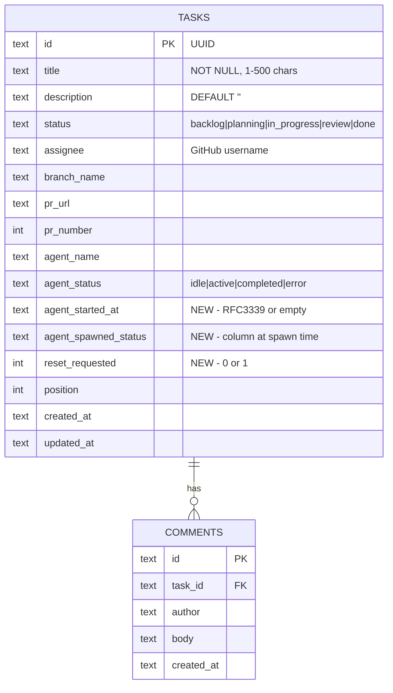

# Agent Monitoring & Color-Coded Status Display

## Overview

Implement a monitoring system that tracks agent lifecycle across kanban stages and displays color-coded status on the board. The system uses agent self-reporting (CLI commands) as the primary completion signal, with tmux window polling as a secondary liveness check. When agents exit, a grace period reconciliation determines whether the agent completed successfully or crashed.

The TUI will display a five-color status system (green/blue/yellow/red/gray) via indicator dots, card border coloring, and elapsed time for active agents.

## Problem Statement

Currently, the agentboard has a rudimentary three-state agent status (`idle`/`active`/`error`) with immediate error marking when a tmux window disappears. This creates several problems:

1. **False errors**: Agents that successfully complete and exit are marked as errors because the TUI detects window death before checking if the task was moved
2. **No completion awareness**: There is no way to distinguish "agent finished this stage" from "agent crashed"
3. **No elapsed time**: Users cannot see how long an agent has been running
4. **No stage chaining**: No mechanism for agents to request a fresh context for the next stage
5. **Flat visual treatment**: Only a dot prefix — no card-level coloring for at-a-glance board scanning

## Proposed Solution

Extend the agent lifecycle with four key changes:

1. **Expand agent status** to `idle | active | completed | error` with "done" derived from task column
2. **Grace period reconciliation** — when a tmux window dies, wait 5s before deciding completed vs. error
3. **`request-reset` CLI command** — agents can request fresh context for the next stage
4. **Rich visual treatment** — five-color dots, card border coloring, elapsed time display

## Technical Approach

### Architecture

The feature spans five layers:

```
┌─────────────────────────────────────────────────┐
│  TUI Layer (internal/tui/)                      │
│  - 5-color styles, card rendering, elapsed time │
│  - Grace period reconciliation state machine    │
├─────────────────────────────────────────────────┤
│  Agent Layer (internal/agent/)                  │
│  - Absolute binary path injection at spawn      │
│  - agent_started_at tracking                    │
├─────────────────────────────────────────────────┤
│  CLI Layer (internal/cli/)                      │
│  - `agent request-reset` command                │
│  - Enhanced `task move` for self-reporting      │
├─────────────────────────────────────────────────┤
│  Service Layer (internal/board/)                │
│  - New methods: SetResetRequested, GetSpawnedStatus │
├─────────────────────────────────────────────────┤
│  DB Layer (internal/db/)                        │
│  - Schema v2 migration                          │
│  - New columns: agent_started_at, reset_requested, │
│    agent_spawned_status                         │
└─────────────────────────────────────────────────┘
```

### Key Design Decisions

**D1: "done" is a rendering concern, not a DB enum value.**
`agent_status` enum becomes `idle | active | completed | error`. When `task.Status == "done"`, the TUI renders the green "done" indicator regardless of `agent_status`. This avoids coupling display logic to persistence.

**D2: Reconciliation uses `agent_spawned_status` to detect completion.**
At spawn time, store the task's current column in `agent_spawned_status`. When a window dies and the grace period elapses:
- Task column differs from `agent_spawned_status` → `completed`
- Task column matches `agent_spawned_status` → `error`

**D3: Grace period runs independently of poll interval.**
When window death is detected, record `{taskID, detectedAt}` in an in-memory `pendingReconciliation` map. Each poll tick checks if 5s has elapsed for pending entries. This avoids poll-interval alignment issues.

**D4: No auto-spawn on CLI-initiated moves.**
When an agent self-reports completion via `task move` and exits, the task enters "completed" (blue/teal) state. The user decides the next action. Auto-spawn only happens via `request-reset`.

**D5: `MoveTask` does NOT update `agent_status`.**
The reconciliation logic handles status transitions. This avoids the ambiguity of whether the agent will keep working after moving (Flow 2) or exit (Flow 3).

### Implementation Phases

#### Phase 1: Database Schema & Models (Foundation)

**Goal**: Extend the data model to support the full agent lifecycle.

**Files to modify:**

- `internal/db/schema.go` — Schema v2 migration
- `internal/db/models.go` — New `AgentStatus` constants, updated `Task` struct
- `internal/db/tasks.go` — New DB operations for reset flag and spawned status
- `internal/db/sqlite.go` — Migration runner for v1 → v2
- `internal/db/tasks_test.go` — Tests for new fields

**Schema migration (v1 → v2):**

```sql
-- Add new agent_status values
-- SQLite doesn't support ALTER CHECK, so we recreate the constraint
-- via a temp table migration pattern

CREATE TABLE tasks_v2 (
    id TEXT PRIMARY KEY,
    title TEXT NOT NULL CHECK(length(title) >= 1 AND length(title) <= 500),
    description TEXT DEFAULT '',
    status TEXT NOT NULL DEFAULT 'backlog'
        CHECK(status IN ('backlog','planning','in_progress','review','done')),
    assignee TEXT DEFAULT '',
    branch_name TEXT DEFAULT '',
    pr_url TEXT DEFAULT '',
    pr_number INTEGER DEFAULT 0,
    agent_name TEXT DEFAULT '',
    agent_status TEXT DEFAULT 'idle'
        CHECK(agent_status IN ('idle','active','completed','error')),
    agent_started_at TEXT DEFAULT '',
    agent_spawned_status TEXT DEFAULT '',
    reset_requested INTEGER DEFAULT 0,
    position INTEGER NOT NULL DEFAULT 0,
    created_at TEXT NOT NULL,
    updated_at TEXT NOT NULL
);

INSERT INTO tasks_v2 SELECT
    id, title, description, status, assignee, branch_name, pr_url,
    pr_number, agent_name, agent_status,
    '' as agent_started_at,
    '' as agent_spawned_status,
    0 as reset_requested,
    position, created_at, updated_at
FROM tasks;

DROP TABLE tasks;
ALTER TABLE tasks_v2 RENAME TO tasks;

-- Recreate indexes
CREATE INDEX idx_tasks_status ON tasks(status);
CREATE INDEX idx_tasks_assignee ON tasks(assignee);
CREATE UNIQUE INDEX idx_tasks_status_position ON tasks(status, position);

UPDATE schema_version SET version = 2;
```

**New Task struct fields:**

```go
type Task struct {
    // ... existing fields ...
    AgentStatus       AgentStatus `json:"agent_status"`       // idle|active|completed|error
    AgentStartedAt    string      `json:"agent_started_at"`   // RFC3339 or ""
    AgentSpawnedStatus string     `json:"agent_spawned_status"` // column at spawn time or ""
    ResetRequested    bool        `json:"reset_requested"`    // agent wants fresh context
}
```

**New AgentStatus constant:**

```go
const AgentCompleted AgentStatus = "completed"
```

**Success criteria:**
- [x] Schema migration v1 → v2 executes cleanly on existing databases
- [x] New fields are readable/writable via CRUD operations
- [x] `scanTask()` updated to handle new columns
- [x] All existing tests pass
- [x] New test: create task, set agent_started_at, verify round-trip
- [x] New test: migrate from v1 schema, verify data preserved

---

#### Phase 2: Visual System (Five-Color Status + Card Styling)

**Goal**: Implement the full color-coded display in the TUI.

**Files to modify:**

- `internal/tui/styles.go` — New color styles for all five states
- `internal/tui/task_item.go` — Status indicator rendering with elapsed time
- `internal/tui/board.go` — Card border/background coloring (custom delegate)

**Five-color style definitions:**

```go
// styles.go additions
var (
    agentDoneStyle      = lipgloss.NewStyle().Foreground(lipgloss.Color("#50fa7b")) // Green
    agentCompletedStyle = lipgloss.NewStyle().Foreground(lipgloss.Color("#8be9fd")) // Cyan/Teal
    agentActiveStyle    = lipgloss.NewStyle().Foreground(lipgloss.Color("#f1fa8c")) // Yellow (changed from green!)
    agentErrorStyle     = lipgloss.NewStyle().Foreground(lipgloss.Color("#ff5555")) // Red (unchanged)
    agentIdleStyle      = lipgloss.NewStyle().Foreground(lipgloss.Color("#888888")) // Gray (unchanged)
)
```

**Status indicator rendering (task_item.go):**

| State | task.Status | task.AgentStatus | Render |
|-------|------------|-----------------|--------|
| Done | `done` | any | `agentDoneStyle.Render("● ")` |
| Completed | not done | `completed` | `agentCompletedStyle.Render("● ")` |
| Active | any | `active` | `agentActiveStyle.Render("● " + elapsed)` |
| Error | any | `error` | `agentErrorStyle.Render("✖ ")` |
| Idle | any | `idle` | `agentIdleStyle.Render("○ ")` |

Priority order: Done > Active > Completed > Error > Idle.
(Active takes priority over Done because if an agent is running on a "done" task, we want to show it's active.)

**Elapsed time formatting:**

```go
func formatElapsed(startedAt string) string {
    t, err := time.Parse(time.RFC3339, startedAt)
    if err != nil || startedAt == "" {
        return ""
    }
    d := time.Since(t)
    switch {
    case d < time.Minute:
        return "<1m"
    case d < time.Hour:
        return fmt.Sprintf("%dm", int(d.Minutes()))
    default:
        return fmt.Sprintf("%dh%dm", int(d.Hours()), int(d.Minutes())%60)
    }
}
```

**Card border coloring:**

Replace the default list delegate with a custom delegate that applies border/background tint based on agent status. The tint uses the same color palette at reduced opacity (achieved via darker shades in the terminal):

```go
// Subtle background tints for card items
var (
    cardDoneBg      = lipgloss.NewStyle().Background(lipgloss.Color("#1a3a2a"))
    cardCompletedBg = lipgloss.NewStyle().Background(lipgloss.Color("#1a2a3a"))
    cardActiveBg    = lipgloss.NewStyle().Background(lipgloss.Color("#3a3a1a"))
    cardErrorBg     = lipgloss.NewStyle().Background(lipgloss.Color("#3a1a1a"))
    // idle: no background tint (default terminal bg)
)
```

**Success criteria:**
- [x] All five status colors render correctly in the TUI
- [x] Active tasks show elapsed time that updates on each render
- [x] Card backgrounds have subtle status tinting
- [ ] Color-coding is visible on both dark and light terminal backgrounds
- [x] Existing `agentActiveStyle` green changed to yellow (breaking change acknowledged)

---

#### Phase 3: Agent Spawn Enhancements

**Goal**: Set `agent_started_at`, `agent_spawned_status`, and inject absolute binary path.

**Files to modify:**

- `internal/agent/spawn.go` — Set timestamps, store spawned status, inject binary path
- `internal/agent/spawn.go` — `Kill()` clears agent_started_at
- `internal/tui/app.go` — Pass service to agent.Spawn for DB writes

**Spawn changes:**

```go
// In Spawn(), after creating the tmux window:
task.AgentStatus = db.AgentActive
task.AgentStartedAt = time.Now().UTC().Format(time.RFC3339)
task.AgentSpawnedStatus = string(task.Status) // remember the column
task.ResetRequested = false                    // clear any stale flag
svc.UpdateTask(ctx, task)
```

**Absolute binary path:**

```go
// In buildSystemPrompt():
exePath, err := os.Executable()
if err != nil {
    exePath = "agentboard" // fallback to PATH
}
// Use exePath in system prompt instead of bare "agentboard"
```

**Kill changes:**

```go
// In Kill(), after killing tmux window:
task.AgentStatus = db.AgentIdle
task.AgentStartedAt = ""
task.AgentSpawnedStatus = ""
task.ResetRequested = false
svc.UpdateTask(ctx, task)
```

**Success criteria:**
- [ ] `agent_started_at` is set to current time on spawn
- [ ] `agent_spawned_status` records the column at spawn time
- [ ] System prompt contains absolute path to agentboard binary
- [ ] `Kill()` clears all agent-related fields
- [ ] Elapsed time displays correctly in TUI after spawn

---

#### Phase 4: Grace Period Reconciliation

**Goal**: Replace immediate error marking with grace-period-based reconciliation.

**Files to modify:**

- `internal/tui/app.go` — New `pendingReconciliation` map, updated `reconcileAgents()`
- `internal/tui/messages.go` — New message types for reconciliation

**Data structure:**

```go
// In App struct:
type pendingRecon struct {
    detectedAt time.Time
    columnAtDetection string
}

type App struct {
    // ... existing ...
    pendingRecon map[string]pendingRecon // taskID -> detection info
}
```

**Reconciliation algorithm (replaces current `reconcileAgents()`):**

```
On each poll tick (every 2500ms):
  liveWindows := tmux.ListWindows()

  For each task where AgentStatus == "active":
    windowName := agent.WindowName(task)

    IF window is alive:
      // Agent is running — stay active, remove from pending if present
      delete(pendingRecon, task.ID)
      continue

    IF task.ID NOT in pendingRecon:
      // Window just died — start grace period
      pendingRecon[task.ID] = {now(), task.Status}
      continue

    IF time.Since(pendingRecon[task.ID].detectedAt) < 5s:
      // Still in grace period — wait
      continue

    // Grace period elapsed — determine outcome
    delete(pendingRecon, task.ID)

    // Re-read task from DB (agent may have moved it during grace period)
    freshTask := svc.GetTask(task.ID)

    IF freshTask.ResetRequested:
      // Agent wants fresh context — respawn
      freshTask.ResetRequested = false
      freshTask.AgentStatus = "idle"
      svc.UpdateTask(freshTask)
      agent.Spawn(freshTask)  // respawn with next-stage prompt

    ELSE IF freshTask.Status != pendingRecon[task.ID].columnAtDetection:
      // Task moved to a new column — agent completed successfully
      freshTask.AgentStatus = "completed"
      freshTask.AgentStartedAt = ""
      freshTask.AgentSpawnedStatus = ""
      svc.UpdateTask(freshTask)

    ELSE:
      // Task still in same column — agent crashed/failed
      freshTask.AgentStatus = "error"
      freshTask.AgentStartedAt = ""
      freshTask.AgentSpawnedStatus = ""
      svc.UpdateTask(freshTask)
```

**Success criteria:**
- [x] Window death does NOT immediately mark task as error
- [x] After 5s grace period, tasks correctly resolve to `completed` or `error`
- [x] Tasks where the agent moved the task before exiting resolve to `completed`
- [x] Tasks where the agent crashed without moving resolve to `error`
- [x] Reset-requested tasks trigger respawn after grace period
- [ ] Manually killed agents (via `A` key) bypass grace period (direct to idle)
- [ ] Test: simulate agent move + exit → verify completed state
- [ ] Test: simulate agent crash → verify error state after 5s

---

#### Phase 5: `request-reset` CLI Command

**Goal**: Enable agents to request a fresh context for the next stage.

**Files to modify:**

- `internal/cli/agent_cmd.go` — New `agent` command group with `request-reset` subcommand
- `internal/board/service.go` — Add `SetResetRequested` to Service interface
- `internal/board/local.go` — Implement `SetResetRequested`

**CLI command:**

```bash
agentboard agent request-reset <task-id>
```

**Implementation:**

```go
// agent_cmd.go
var agentCmd = &cobra.Command{
    Use:   "agent",
    Short: "Agent lifecycle commands",
}

var requestResetCmd = &cobra.Command{
    Use:   "request-reset <task-id>",
    Short: "Request fresh context for next stage",
    Args:  cobra.ExactArgs(1),
    RunE: func(cmd *cobra.Command, args []string) error {
        svc := openService()
        task := findByPrefix(svc, args[0])
        task.ResetRequested = true
        return svc.UpdateTask(ctx, task)
    },
}
```

**Service interface addition:**

```go
// No new method needed — UpdateTask handles setting ResetRequested.
// The reset flag is just a field on the task, updated via the existing UpdateTask path.
```

**Success criteria:**
- [x] `agentboard agent request-reset <task-id>` sets the reset flag in DB
- [x] TUI reconciliation detects the flag and marks task ready for respawn
- [ ] The respawned agent gets the next-stage prompt (based on current column)
- [x] The reset flag is cleared after respawn
- [x] Error case: calling on a task with no active agent prints a warning

---

#### Phase 6: Bug Fixes & Polish

**Goal**: Address gaps identified in SpecFlow analysis.

**Files to modify:**

- `internal/tui/app.go` — Fix task deletion to kill agent window
- `internal/tui/app.go` — Always poll (don't stop when no active agents)
- `internal/tui/app.go` — On TUI startup, reconcile stale `active` states

**Bug fix 1: Delete task must kill agent (Gap 17):**

```go
// In deleteTask(), before svc.DeleteTask():
if task.AgentStatus == db.AgentActive {
    windowName := agent.WindowName(task)
    tmux.KillWindow(windowName)
}
```

**Bug fix 2: Always poll for agent status (Gap 22):**

The current logic stops polling when no tasks have `AgentActive`. This causes stale state if agents are spawned externally. Change to always poll while the TUI is running (the 2500ms interval is lightweight — just a `tmux list-windows` call).

**Bug fix 3: Startup reconciliation (Gap: TUI restart with stale state):**

On `tasksLoadedMsg`, check all tasks with `AgentStatus == active` against live tmux windows. For any with no live window, immediately start grace period reconciliation (these may have died while the TUI was not running, so the grace period is just a courtesy check — they likely need error marking).

**Bug fix 4: Backward move resets agent status (Gap: moving done → in_progress):**

When a task is moved via TUI and no agent window is alive, reset `agent_status` to `idle` and clear `agent_started_at`, `agent_spawned_status`, `reset_requested`.

**Success criteria:**
- [x] Deleting a task with an active agent kills the tmux window
- [x] Agent polling runs continuously while TUI is open
- [x] TUI startup reconciles stale agent states
- [x] Moving a task backward clears stale agent status

## Acceptance Criteria

### Functional Requirements

- [ ] Five-color status system renders correctly: green (done), blue/teal (completed), yellow (active + elapsed time), red (error), gray (idle)
- [ ] Agent spawn sets `agent_started_at` and `agent_spawned_status`
- [ ] Grace period (5s) prevents false error marking when agents exit after moving tasks
- [ ] `agentboard agent request-reset <task-id>` sets reset flag and triggers respawn after agent exits
- [ ] Absolute binary path injected into agent system prompts via `os.Executable()`
- [ ] Card border/background has subtle status-colored tinting
- [ ] Elapsed time displays for active agents and updates on each render cycle

### Non-Functional Requirements

- [ ] Schema migration v1 → v2 is safe (transactional, preserves data)
- [ ] Polling overhead remains low (~1 tmux command per 2500ms)
- [ ] No new goroutines beyond existing patterns (polling via `tea.Cmd`)
- [ ] Grace period logic is deterministic (no flaky behavior under load)

### Quality Gates

- [ ] All existing tests pass after changes
- [ ] New unit tests for: schema migration, reconciliation logic, elapsed time formatting, status rendering
- [ ] Manual testing: spawn agent, let it complete, verify blue/teal → verify green when moved to done
- [ ] Manual testing: kill tmux window manually, verify red after 5s grace period
- [ ] Manual testing: request-reset flow end-to-end

## Dependencies & Prerequisites

- **Review column**: The TUI board currently has 4 columns (`backlog`, `planning`, `in_progress`, `done`). The DB schema includes `review` but the TUI does not render it. This feature assumes `review` will be added (separate worktree `add-review-column` exists). The monitoring feature works without it but the full lifecycle (`in_progress → review → done`) requires it.
- **No external dependencies**: All changes use existing Go stdlib + charmbracelet ecosystem.

## Risk Analysis & Mitigation

| Risk | Likelihood | Impact | Mitigation |
|------|-----------|--------|------------|
| Schema migration corrupts data | Low | High | Transactional migration with backup; test on copy first |
| Grace period too short (false errors) | Medium | Medium | Start at 5s, make configurable via const; monitor in practice |
| Grace period too long (delayed feedback) | Low | Low | 5s is short enough; card stays yellow during grace |
| Custom list delegate breaks bubbles/list | Medium | Medium | Minimal delegate — only override Render, keep all other behavior |
| Absolute path breaks if binary moves | Low | Low | Fallback to bare `agentboard` in PATH |
| `request-reset` called on wrong task | Low | Low | Validate task has active agent; print warning otherwise |

## File Change Summary

| File | Change Type | Phase |
|------|------------|-------|
| `internal/db/schema.go` | Modify — add v2 migration SQL | 1 |
| `internal/db/models.go` | Modify — add `AgentCompleted`, new fields | 1 |
| `internal/db/tasks.go` | Modify — update `scanTask`, add new columns to queries | 1 |
| `internal/db/sqlite.go` | Modify — add migration runner logic | 1 |
| `internal/db/tasks_test.go` | Modify — test new fields, migration | 1 |
| `internal/tui/styles.go` | Modify — five-color palette, card tint styles | 2 |
| `internal/tui/task_item.go` | Modify — status indicator logic, elapsed time | 2 |
| `internal/tui/board.go` | Modify — custom delegate for card coloring | 2 |
| `internal/agent/spawn.go` | Modify — timestamps, binary path, spawned status | 3 |
| `internal/tui/app.go` | Modify — grace period reconciliation, bug fixes | 4, 6 |
| `internal/tui/messages.go` | Modify — new message types | 4 |
| `internal/cli/agent_cmd.go` | Create — `agent request-reset` command | 5 |
| `internal/cli/root.go` | Modify — register `agentCmd` | 5 |
| `internal/board/service.go` | No change needed (UpdateTask suffices) | — |

## ERD Changes



## References & Research

### Internal References

- Brainstorm (design decisions): `docs/brainstorms/2026-02-23-agent-monitoring-brainstorm.md`
- System brainstorm (architecture context): `docs/brainstorms/2026-02-23-agentboard-brainstorm.md`
- Existing plan (Phase 1-5 roadmap): `docs/plans/2026-02-23-feat-agentboard-collaborative-kanban-tui-plan.md`
- Current agent polling: `internal/tui/app.go:516-558`
- Current status rendering: `internal/tui/task_item.go:13-23`
- Current styles: `internal/tui/styles.go:34-39`
- Schema definition: `internal/db/schema.go:5-46`
- Task model: `internal/db/models.go:31-45`
- Agent spawn: `internal/agent/spawn.go:44-84`
- tmux manager: `internal/tmux/manager.go`
- CLI task commands: `internal/cli/task_cmd.go`

### SpecFlow Gaps Addressed

- Gap 1-2: Schema migration with expanded CHECK constraint (Phase 1)
- Gap 4: Error → active transition allowed via spawn (Phase 3)
- Gap 5: Completed state with manual or reset-based progression (Phase 4-5)
- Gap 6-7: Grace period with in-memory pending map (Phase 4)
- Gap 8-9: Reset flag stored as DB column with stale-flag handling (Phase 5)
- Gap 10: `agent_started_at` column (Phase 1, displayed Phase 2)
- Gap 12: Reconciliation uses `agent_spawned_status` instead of `MoveTask` changes (Phase 4)
- Gap 17: Delete task kills agent window (Phase 6)
- Gap 18-19: Color palette corrected (Phase 2)
- Gap 20: Custom list delegate for card coloring (Phase 2)
- Gap 22: Always-on polling (Phase 6)
- Gap 23: `os.Executable()` path injection (Phase 3)

### Deferred (Out of Scope)

- Gap 3: Review column addition (separate worktree)
- Gap 11: Historical agent run tracking (future feature)
- Gap 13-14: Backward move / cross-agent move validation (future feature)
- Gap 16: Bulk recovery after tmux server death (future feature)
- Gap 24: CLI connection graceful shutdown (low risk, defer)
